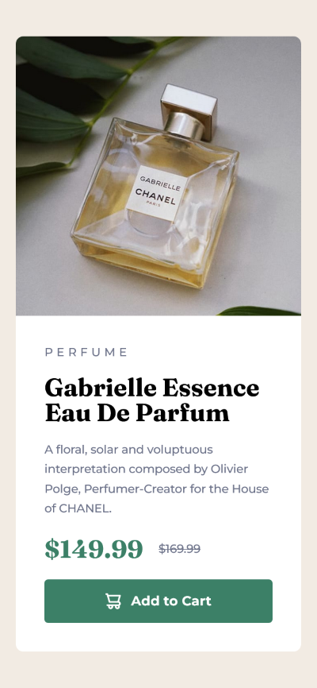

# Frontend Mentor - Product preview card component solution

This is a solution to the [Product preview card component challenge on Frontend Mentor](https://www.frontendmentor.io/challenges/product-preview-card-component-GO7UmttRfa). Frontend Mentor challenges help you improve your coding skills by building realistic projects. 

## Table of contents

- [Overview](#overview)
  - [The challenge](#the-challenge)
  - [Screenshot](#screenshot)
- [My process](#my-process)
  - [Built with](#built-with)
  - [What I learned](#what-i-learned)
  - [Continued development](#continued-development)
  - [Useful resources](#useful-resources)
  - [AI Collaboration](#ai-collaboration)
- [Author](#author)

**Note: Delete this note and update the table of contents based on what sections you keep.**

## Overview

### The challenge

Users should be able to:

- View the optimal layout depending on their device's screen size
- See hover and focus states for interactive elements

### Screenshot

## My process

### Built with

- Semantic HTML5 markup
- CSS custom properties
- Flexbox

### What I learned

- Wrapping an image in a container is recommended for layout because flex arranges the "boxes" and image sizing is a separate problem from layout.
- How content width affect container layout.
- It's best to use svg tag for icon. I haven't used it here because I'm still new to the concept, though.
- How to use media query for a more responsive design (e.g. changing the flex direction, choosing which image to display). However, it isn't the most flexible solution to account for a wider range of screen sizes.

### Continued development

I would like to learn using percentages for better responsivity going forward.

### Useful resources

- [CSS tricks flexbox](https://css-tricks.com/snippets/css/a-guide-to-flexbox/) - This is definitely the best flexbox guide out there. Its inclusion of illustrations is very helpful in understanding how flexbox layout works.
- [CSS w3schools](https://www.w3schools.com/cssref/index.php) - This is a good overview of every CSS property.

### AI Collaboration

I used ChatGPT to help me understand errors and little quirks about how CSS is rendered. I also used it to check my solutions for problems I'm new to (e.g. how to add icon to button or how to change flex direction and image displayed for smaller screen), to get advices on what I can do better or information about the best practice solutions.

## Author

- Frontend Mentor - [@KarinaMay0](https://www.frontendmentor.io/profile/KarinaMay0)